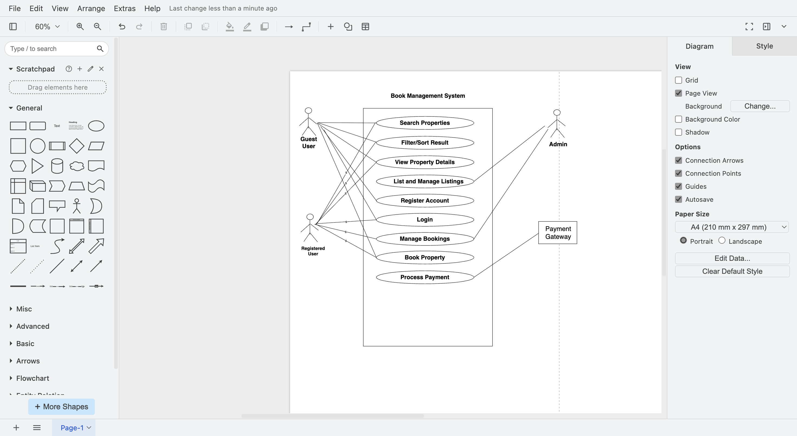

# Introduction
This project is about understanding the concept of requirement analysis.

## What is Requirement Analysis?
The Requirement Analysis Project focuses on crafting a comprehensive foundation for software development by documenting, analyzing, and structuring requirements. Through a series of well-defined tasks, learners will create a detailed blueprint of the requirement analysis phase for a booking management system. This project simulates a real-world development scenario, emphasizing clarity, precision, and structure in defining requirements to set the stage for successful project execution.

## Why is Requirement Analysis Important?
Requirement Analysis plays a critical role in the Software Development Life Cycle (SDLC) because it ensures that the software being built truly meets the needs of its stakeholders. Below are some key reasons why it is important:

1. **Clarity and Understanding**  
   It helps eliminate ambiguity by ensuring all stakeholders and developers share the same understanding of what the system should do. This prevents misinterpretation of requirements.

2. **Scope Definition**  
   Requirement Analysis defines the boundaries of the project. By clearly identifying what is in scope and what is not, it helps prevent scope creep — the uncontrolled addition of features during development.

3. **Basis for Design and Development**  
   It provides a solid foundation for the design and development phases. Without a well-defined set of requirements, developers risk building a system that doesn’t align with user needs.

4. **Cost and Time Estimation**  
   With clear requirements, teams can better estimate project timelines, allocate resources, and forecast costs accurately.

5. **Quality Assurance**  
   Ensures that the final product meets the specified requirements, leading to higher user satisfaction and reduced risk of project failure.

## Key Activities in Requirement Analysis
Requirement Analysis consists of five main activities that ensure the requirements are well-defined, structured, and validated. These activities include:

- **Requirement Gathering**  
  - Collect requirements from stakeholders through interviews, surveys, workshops, observation, and document analysis.  
  - Helps capture the initial needs and expectations of the system.  

- **Requirement Elicitation**  
  - Refine and expand gathered requirements using brainstorming sessions, focus groups, and prototyping.  
  - Ensures that requirements are clear, complete, and aligned with stakeholder goals.  

- **Requirement Documentation**  
  - Record requirements in structured formats such as Requirement Specification Documents, user stories, or use cases.  
  - Provides a written reference that guides design, development, and testing.  

- **Requirement Analysis and Modeling**  
  - Analyze requirements to prioritize them and check their feasibility against technical, financial, and time constraints.  
  - Create models (e.g., data flow diagrams, entity-relationship diagrams) to visualize system processes and interactions.  

- **Requirement Validation**  
  - Review requirements with stakeholders to ensure accuracy and completeness.  
  - Define acceptance criteria and establish traceability to verify that all requirements are addressed during development and testing.  

## Types of Requirements
Requirements in software development are broadly categorized into two types: Functional and Non-functional. Both are essential to ensure the system not only performs its intended tasks but also does so efficiently and reliably.

### Functional Requirements
**Definition:**  
Functional requirements describe *what the system should do*. They define specific behaviors, tasks, or functions the system must perform.  

**Examples for Booking Management System:**  
- **Search Properties:** Users should be able to search for properties based on location, price range, and availability.  
- **User Registration:** New users should be able to create an account with personal details and login credentials.  
- **Property Listings:** The system should display available properties with details such as price, images, and descriptions.  
- **Booking System:** Users should be able to book properties, view booking details, and manage their bookings.  
- **User Authentication:** Secure login and registration process for users with proper credential checks.  

### Non-functional Requirements
**Definition:**  
Non-functional requirements describe *how the system should perform*. They define system attributes like performance, usability, reliability, and security.  

**Examples for Booking Management System:**  
- **Performance:** Pages should load within 2 seconds and the system should handle up to 1,000 concurrent users.  
- **Security:** User data must be encrypted, logins must be secure, and the system must protect against vulnerabilities like SQL injection or cross-site scripting.  
- **Scalability:** The system should support horizontal scaling to handle increased traffic and larger datasets.  
- **Usability:** The interface should be intuitive and user-friendly, enabling users to complete bookings with minimal steps.  
- **Reliability:** The system should have 99.9% uptime and recover quickly in case of system failures.  

## Use Case Diagrams

**What are Use Case Diagrams?**  
Use case diagrams are UML visuals that show how **actors** (users or external systems) interact with the software to achieve goals (**use cases**). They help teams quickly understand who uses the system and what they can do with it.

**Benefits**
- Provide a high-level, shared view of system functionality for all stakeholders.
- Help uncover missing or overlapping requirements early.
- Serve as a conversation aid during analysis, design, and testing.
- Clarify system boundaries and external dependencies.

**Booking System – Use Case Diagram**  
Actors:
- **Guest**
- **Registered User**
- **Admin**
- **Payment Gateway** (external system)

Key Use Cases:
- **Search Properties**
- **Filter/Sort Results**
- **View Property Details**
- **Register Account**
- **Login**
- **Book Property**
- **Manage Bookings**
- **List/Manage Listings** (Admin)
- **Process Payment** (via Payment Gateway)

**Diagram (PNG):**  

